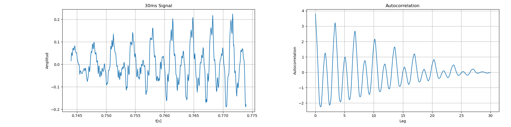

PAV - P3: estimación de pitch
=============================

Esta práctica se distribuye a través del repositorio GitHub [Práctica 3](https://github.com/albino-pav/P3).
Siga las instrucciones de la [Práctica 2](https://github.com/albino-pav/P2) para realizar un `fork` de la
misma y distribuir copias locales (*clones*) del mismo a los distintos integrantes del grupo de prácticas.

Recuerde realizar el *pull request* al repositorio original una vez completada la práctica.

Ejercicios básicos
------------------

- Complete el código de los ficheros necesarios para realizar la estimación de pitch usando el programa
  `get_pitch`.

   * Complete el cálculo de la autocorrelación e inserte a continuación el código correspondiente.
Hemos usado la siguiente formula: $r[l] = \frac{1}{N} \sum_N x[n-l]x[n]$ teniendo en cuenta que $x[n]$ será una señal real
  ```cpp
  void PitchAnalyzer::autocorrelation(const vector<float> &x, vector<float> &r) const {

    for (unsigned int l = 0; l < r.size(); ++l) { // This for is per every l value 
  		/// \TODO Compute the autocorrelation r[l]
      /// \FET Autocorrelació computada amb la fòrmula r[l] = \frac{1}{N} \sum_{n=l}^{N}x[n-l]x[n]
      r[l] = 0;
      for (unsigned int n = l; n < x.size(); n++)
      {
        r[l] += x[n]*x[n-l];
      }
      r[l] = r[l]/x.size();
    }

    if (r[0] == 0.0F) //to avoid log() and divide zero 
      r[0] = 1e-10; 
  }
  ```

   * Inserte una gŕafica donde, en un *subplot*, se vea con claridad la señal temporal de un segmento de unos 30 ms de un fonema sonoro y su periodo de pitch; y, en otro *subplot*, se vea con claridad la
	 autocorrelación de la señal y la posición del primer máximo secundario.

	 NOTA: es más que probable que tenga que usar Python, Octave/MATLAB u otro programa semejante para
	 hacerlo. Se valorará la utilización de la biblioteca matplotlib de Python.

  Hemos usado python para generar estos gráficos, vean [aquí](./autocorrelacion.py)
  
  

   * Determine el mejor candidato para el periodo de pitch localizando el primer máximo secundario de la autocorrelación. Inserte a continuación el código correspondiente.

  Para encontrar el mejor candidato para el periodo de pitch localizando el primer máximo secundario de la autocorrelación hemos buscado el primer máximo después del origen (excluyendo el pico en el origen); para hacerlo hacemos lo siguiente:
   
   1. Inicializamos: iniciamos `rmax`con el valor de `npictch_min`y establezemos el periodo en eso.
   2. Bucle en los valores de la autocorrelación: hacemos un bucle que va des de `npitch_min` hasta `npitch_max` y buscamos un valor mayor a `rMax`; si lo encontramos, actualizamos `rMax` y Lag
   3. Calculamos la potencia: La potencia de la señal se calcula utilizando el valor de la autocorrelación en el lag 0. Para evitar tomar el logaritmo de cero, r[0] se establece en un valor pequeño (1e-10) si es cero.

   Y así básicamente obtenemos el valor del segundo máximo excluyendo el primer pico. El codigo se que implementa el proceso descrito es el siguiente:
   ```cpp
   float rMax = r[npitch_min];
    unsigned int lag = npitch_min;

    for (unsigned int l = npitch_min; l < npitch_max; l++) {
      if(r[l]>rMax){
        lag = l;
        rMax = r[l];
      }
    }
    //unsigned int lag = iRMax - r.begin();

    float pot = 10 * log10(r[0]);
    ```

   * Implemente la regla de decisión sonoro o sordo e inserte el código correspondiente.

  ```cpp
  bool PitchAnalyzer::unvoiced(float pot, float r1norm, float rmaxnorm) const {
    // De moment hem trobat que el millor rendiment és amb llindar_rmax = 0.5, llindar_r1norm = 0.75 i llindar_pot = -50
    if (rmaxnorm < this->llindar_rmax || r1norm < this->llindar_r1norm || pot < this->llindar_pot){ 
      return true;
    }  
    return false;
  }
  ```

   * Puede serle útil seguir las instrucciones contenidas en el documento adjunto `código.pdf`.

- Una vez completados los puntos anteriores, dispondrá de una primera versión del estimador de pitch. El 
  resto del trabajo consiste, básicamente, en obtener las mejores prestaciones posibles con él.

  * Utilice el programa `wavesurfer` para analizar las condiciones apropiadas para determinar si un
    segmento es sonoro o sordo. 

    Hemso puesto con nuestro estimador ya completado (no es el mismo que el de clase) y lo usaremos para toda esta parte
    ```bash
    get_pitch prueba.wav prueba.f0
    ```
      
	
	  - Inserte una gráfica con la estimación de pitch incorporada a `wavesurfer` y, junto a ella, los 
	    principales candidatos para determinar la sonoridad de la voz: el nivel de potencia de la señal
		(r[0]), la autocorrelación normalizada de uno (r1norm = r[1] / r[0]) y el valor de la
		autocorrelación en su máximo secundario (rmaxnorm = r[lag] / r[0]).

		Puede considerar, también, la conveniencia de usar la tasa de cruces por cero.

	  Recuerde configurar los paneles de datos para que el desplazamiento de ventana sea el adecuado, que
		en esta práctica es de 15 ms.

Para obtener los valores de r1norm y rmax, hemos recurrido al [fichero de la autocorrelación](./autocorrelacion.py) anteriormente usado 
    


      - Use el estimador de pitch implementado en el programa `wavesurfer` en una señal de prueba y compare
	    su resultado con el obtenido por la mejor versión de su propio sistema.  Inserte una gráfica
		ilustrativa del resultado de ambos estimadores.
     
		Aunque puede usar el propio Wavesurfer para obtener la representación, se valorará
	 	el uso de alternativas de mayor calidad (particularmente Python).

Hemos usado [un programa en python](./system_pitchest.py) para obtener la diferencia:
  
  * Optimice los parámetros de su sistema de estimación de pitch e inserte una tabla con las tasas de error
    y el *score* TOTAL proporcionados por `pitch_evaluate` en la evaluación de la base de datos 
	`pitch_db/train`..
  ### Summary

  | Metric                          | Value                |
  |---------------------------------|----------------------|
  | Num. frames                     | 11200 = 7045 unvoiced + 4155 voiced |
  | Unvoiced frames as voiced       | 249/7045 (3.53 %)    |
  | Voiced frames as unvoiced       | 414/4155 (9.96 %)    |
  | Gross voiced errors (+20.00 %)  | 51/3741 (1.36 %)     |
  | MSE of fine errors              | 2.65 %               |
  | **TOTAL**                       | **90.86 %**          |

Ejercicios de ampliación
------------------------

- Usando la librería `docopt_cpp`, modifique el fichero `get_pitch.cpp` para incorporar los parámetros del
  estimador a los argumentos de la línea de comandos.
  
  Esta técnica le resultará especialmente útil para optimizar los parámetros del estimador. Recuerde que
  una parte importante de la evaluación recaerá en el resultado obtenido en la estimación de pitch en la
  base de datos.

  * Inserte un *pantallazo* en el que se vea el mensaje de ayuda del programa y un ejemplo de utilización
    con los argumentos añadidos. (vea en las primera línes de el programa [get_pitch.cpp](./src/get_pitch/get_pitch.cpp)
    

- Implemente las técnicas que considere oportunas para optimizar las prestaciones del sistema de estimación
  de pitch.

  Entre las posibles mejoras, puede escoger una o más de las siguientes:

  * Técnicas de preprocesado: filtrado paso bajo, diezmado, *center clipping*, etc.

  Hemos implementado el central clipping en el fichero [get_pitch](./src/get_pitch/get_pitch.cpp) con el siguiente código:
  ```cpp
  float max_val = *max_element(x.begin(), x.end());
  float min_val = *min_element(x.begin(), x.end());
  float threshold = 0.01 * max(max_val, -min_val);

  for (auto &sample : x) {
    if (abs(sample) < threshold) {
      sample = 0;
    }
  }
  ```
  * Técnicas de postprocesado: filtro de mediana, *dynamic time warping*, etc.
  * Métodos alternativos a la autocorrelación: procesado cepstral, *average magnitude difference function*
    (AMDF), etc.

      Hemos implementado el filtro de mediana en el fichero [get_pitch](./src/get_pitch/get_pitch.cpp) con el siguiente código:
  ```cpp
  vector<float> f0_filtered(f0.size());
  int filter_size = 3; // Size of the median filter window
  for (size_t i = 0; i < f0.size(); ++i) {
    vector<float> window;
    for (int j = -filter_size / 2; j <= filter_size / 2; ++j) {
      if (i + j >= 0 && i + j < f0.size()) {
        window.push_back(f0[i + j]);
      }
    }
    sort(window.begin(), window.end());
    f0_filtered[i] = window[window.size() / 2];
  }
  f0 = f0_filtered;
  ```
  * Optimización **demostrable** de los parámetros que gobiernan el estimador, en concreto, de los que gobiernan la decisión sonoro/sordo.

  Hemos usado el fichero [optimización de umbrales sordo/sonoro](./llindars) que prueba el rendimiento en diferentes valores. Puede ver el fichero enlazado o el siguiente código

  ```bash
  #! /bin/bash

  for rmax in $(seq 0.30 0.01 0.41); do
    for r1norm in $(seq 0.74 0.01 0.77); do
      for pot in $(seq -43 1 -39); do
        echo -en "$rmax\t$r1norm\t$pot\t"
        scripts/run_get_pitch.sh $rmax $r1norm $pot | grep TOTAL
      done
    done
  done | sort -t: -k2n
  ```
  * Cualquier otra técnica que se le pueda ocurrir o encuentre en la literatura.

  Encontrará más información acerca de estas técnicas en las [Transparencias del Curso](https://atenea.upc.edu/pluginfile.php/2908770/mod_resource/content/3/2b_PS%20Techniques.pdf)
  y en [Spoken Language Processing](https://discovery.upc.edu/iii/encore/record/C__Rb1233593?lang=cat).
  También encontrará más información en los anexos del enunciado de esta práctica.

  Incluya, a continuación, una explicación de las técnicas incorporadas al estimador. Se valorará la
  inclusión de gráficas, tablas, código o cualquier otra cosa que ayude a comprender el trabajo realizado.

  También se valorará la realización de un estudio de los parámetros involucrados. Por ejemplo, si se opta
  por implementar el filtro de mediana, se valorará el análisis de los resultados obtenidos en función de
  la longitud del filtro.
   

Evaluación *ciega* del estimador
-------------------------------

Antes de realizar el *pull request* debe asegurarse de que su repositorio contiene los ficheros necesarios
para compilar los programas correctamente ejecutando `make release`.

Con los ejecutables construidos de esta manera, los profesores de la asignatura procederán a evaluar el
estimador con la parte de test de la base de datos (desconocida para los alumnos). Una parte importante de
la nota de la práctica recaerá en el resultado de esta evaluación.
